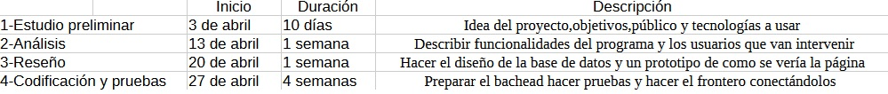

# Anteproxecto fin de ciclo

- [Anteproxecto fin de ciclo](#anteproxecto-fin-de-ciclo)
  - [1- Descrición do proxecto](#1--descrición-do-proxecto)
  - [2- Empresa](#2--empresa)
    - [2.1- Idea de negocio](#21--idea-de-negocio)
    - [2.2- Xustificación da idea](#22--xustificación-da-idea)
    - [2.3- Segmento de clientes](#23--segmento-de-clientes)
    - [2.4- Competencia](#24--competencia)
    - [2.5- Proposta de valor](#25--proposta-de-valor)
    - [2.6- Forma xurídica](#26--forma-xurídica)
    - [2.7- Investimentos](#27--investimentos)
      - [2.7.1- Custos](#271--custos)
      - [2.7.2- Ingresos](#272--ingresos)
    - [2.8- Viabilidade](#28--viabilidade)
      - [2.8.1- Viabilidade técnica](#281--viabilidade-técnica)
      - [2.8.2 - Viabilidade económica](#282---viabilidade-económica)
      - [2.8.3- Conclusión](#283--conclusión)
  - [3- Requirimentos técnicos](#3--requirimentos-técnicos)
  - [4- Planificación](#4--planificación)

## 1- Descrición do proxecto

El proyecto va sobre un administrador de tareas para desarrolladores que quieran tener organizado sus proyectos tanto personales como de trabajo y tener un seguimiento más claro.
La página tendrá la función de que el desarrollador o incluso proyectos de la propia empresa puede crear tareas y declararlas en que entorno están en ese momento,como desarrollo o produción donde podrá dejar comentarios para saber como lleva esa tarea o que problemas tiene que arreglar como una descripción.También puede poner la duración estimada que le llevaría para esa tarea o poner una fecha límite para tener una mejor organización.En el caso de tener varias tareas podrá filtrarlas para saber las que están completadas en desarrollo. Tendrá la opción
Lo que buscamos es ofrecer a los programadores una web útil para el uso del día a día,organizar su trabajo en las empresas y poder darles algo hecho solo para ellos.
Se ve posible la oportunidad de negocio ya que la gran demanda que sigue habiendo de desarrolladores a nivel global,hace que sea necesario una herramienta específica para ellos.La web tendría un acceso premium mensual donde daría más acceso a programar más tareas y incluso la posibilidad de compartir esas tareas con compañeros que estarán agregados como amigos para tener un acesso más rápido permitiendo una mayor eficiencia y un trabajo más en equipo,con la gratis solo te daría la posibilidad de tener hasta 2 tareas y no podrías compartirlas.
Las tecnologías más adecuadas para el proyecto serían:  
  -Para el backend Java con Spring Boot  
  -Frontend JavaScript con Html,Css y Figma.   
  -MySQL como base de datos  
  -Stripe para el sistema de pagos  

## 2- Empresa

### 2.1- Idea de negocio

El producto central es una página web hecha para desarrolladores puedan organizar sus tareas de forma eficiente.
El valor de esto es que está hecha específicamente para programadores.No es un administrador de tareas genérico si no para definir proyectos.
Se ofrece versión premium donde se podrá gestionar más tareas y poder manejarlas y comentarlas a la vez con compañeros.

### 2.2- Xustificación da idea

La idea surgió a partir de la necesidad que se veía para los desarrolladores donde podrían tener algo con una organización que estea adaptada a su forma de trabajo,muchos usan aplicaciones genéricas pero no están diseñadas para su trabajo específico.
Con este proyecto se busca cubrir una necesidad concreta,los desarrolladores de software,tanto freelance como en empresas pequeñas no tienen una herramienta que sea específica para gestionar sus tareas.
Actualmente existen aplicaciones como Trello o Notion que están diseñadas para un público más genérico y no están diseñadas específicamente para programadores.
Se podría decir que en este aspecto está poco atendido aunque el sector de desarrolo no es algo nuevo por lo cual crea una necesidad de poder darles una herramienta.

Análises DAFO

.jpg>)

 
### 2.3- Segmento de clientes

Va dirigido a desarrolladores de software,como freelancers o empleados de empresas o incluso la propia empresa que quieran organizar sus propias tareas relacionados con el desarrollo de forma más productiva y técnica.
Actualmente existen unos 28 millones de desarrolladores a nivel global y no solo a nivel remoto cada vez hay más empresas que siguen esta modalidad, y despúes la demanda de proyectos nuevos para empresas grandes y pequeñas hacen que la organización sea clave en estos aspectos.

Usuario:Es el desarrollador que usa la web
Cliente:El que paga la suscripción premium para poder dar más funcionalidades a sus tareas.

### 2.4- Competencia

Actualmente hay varias webs que te dan la posibilidad de organizar tus tareas pero no están orientadas al mundo del desarrollo,podemos ver algunas como:
Trello:Es de la más populares para el administrar tareas
Notion:Gran herramienta usada principalmente por estudiantes.
Hay productos que están centrados en el desarrollo como GitHub pero esta está hecha para subir tus proyectos o compartirlos,nosotros hablamos de un organizador de tareas donde tendrás unas pautas propias para continuar en ese proyecto.

### 2.5- Proposta de valor

La página se diferencia principalmente de otras por estar diseñado concretamente para desarrolladores.A diferencia de otras competencias como Trello, la nuestra tiene unas diferencias clave:
-Poder gestionar tareas según el entorno en que esten (desarrollo,staging,produccion,test...)
-Poder hacer comentarios de como va la tarea o que problemas estas teniendo
-Dar un tiempo estimado a la tarea y las horas que te lleva al final
-Buscador donde podrás filtrar tus tareas activas según el entorno en que estean
-Posibilidad de compartir y trabajar junto a compañeros de trabajo
-Interfaz clara y organizada
Que valores aporta al mercado pues:
-Organización y eficacia a programadores que programan día a día
-Realizada para todo tipo de formas de trabajo como freelance,Ceo de empresas y pequeñas también.
Por que deberían usar la página,porque al estar enfocado solo para desarrolladores les da un enfoque claro a su forma de trabajo y de tenerlo todo claro y organizado. 

### 2.6- Forma xurídica

La más adecuada para el proyecto es autónomo porque al ser un proyecto inicial con poco coste y sin socios,de esta forma la hace más rápido y cómodo para empezar.

### 2.7- Investimentos

Detalles de gastos:
-Ordenador de trabajo:800€
-Conexion a Internet:25€/mes
-Dominio Web:30€/año
-Publicidad:250€
-Mesa de trabajo:250€

TOTAL:1.630€

#### 2.7.1- Custos

Costes fijos:
-Conexion a Internet:25€/mes
-Dominio Web:30€/año
-Publicidad:250€

Costes variables
-Comisiones de plataforma de pago según las ventas 2%*venta
-Posibles problemas puntuales a partir de 100€

#### 2.7.2- Ingresos

Política de precios:
-Versión gratuita con derecho a manejar dos tareas activas
-Versión premium(6,99€/mes) donde podrás diseñar tus tareas cuántas quieras y compartirlas con tus compañeros de proyecto.

Previsión de ventas:
1 año
usuarios:100
Ingreso anual:8.400€

2 año
usuarios:220
ingreso anual:18.480€

3 año
usuarios:350
Ingreso anual:29.400€

### 2.8- Viabilidade

#### 2.8.1- Viabilidade técnica

Desde la vista técnica el proyecto es viable,el desarrollo de la página como podemos observar no necesitamos una maquinaria compleja ni costosa ya que con solo tener un ordenador decente con conexión a internet podremos diseñarla y ponerla a funcionar sin problema.
Despues las tecnologías elegidas para el backend y el frontend considero que son las más adecuadas porque dan facibilidad a la escabilidad del proyecto.

#### 2.8.2 - Viabilidade económica

Desde la vista económica,el proyecto se ve viable con inversión y costes bajos al inicio.La web podría puede ser desarrollada por una persona sin problema y al ser ese caso reduce los costes considerablemante no necesitando contratación de personal externo al inicio.
Con las inversiones dadas en la parte de costes la inversión inicial,es un gasto bajo para empezar con la suma total de 1.330€.Con unos costes fijos entre conexión a internet,dominio web y gasto de publicidad cada año llegaría a una media de 1.440€
Con los costes que obervamos tanto en inversión inicial y costes fijos podemos decir que la invsersin inicial para este proyecto es asumible para una persona.

#### 2.8.3- Conclusión

Con lo que hemos estudiado sobre todas las inversiones,ventas y todo el plan económico,podemos decir que la página es viable,los gastos iniciales no supondrían un riesgo para empezar.
Con la previsión de las ventas estimadas y con el pco gasto se podría llegar a cubrir los costes con los beneficios y a medida que aumenten esto no permitirá mejorar las funcionalidades de la web y la escabilidad de la misma.
En caso de que haya pérdidas se podría ayudar a cubrir gastos mediante las subvenciones para autonómos de emprendimiento digital o otras como subvenciones para jóvenes o solicitar créditos a bancos.
En tal caso el proyecto se ve un futuro con escabilidad y ganancias en un nicho con auje.

## 3- Requirimentos técnicos

**Infraestructura**:Se desplegará en local desde una máquina virtual o incluso se podría sin el,se usará como servidor de base de datos MySQL, necesitaremos de almacenamiento no mucha cosa porque es instalar el MySQL y por comodidad un IDE como visual Studio Code, y de memoria es importante, pero con unos 16GB o menos no deberia haber problema.  
**Backend:** :Java con Spring Boot con librerias para conectarme a la base de datos y otra de autentificacion de usuarios ya que al estar aprendiendo en las practicas sería la mejor opción para practicar.  
**Frontend:**:JavaScript con HTML y CSS.  

## 4- Planificación 

[**<-Anterior**](../../README.md)
